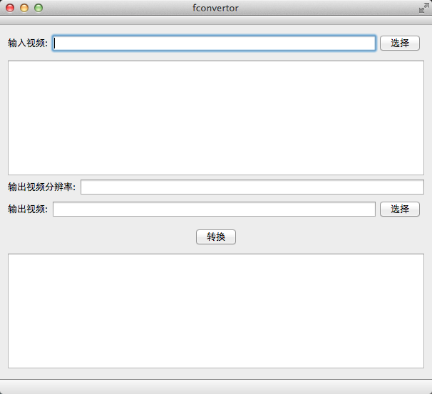
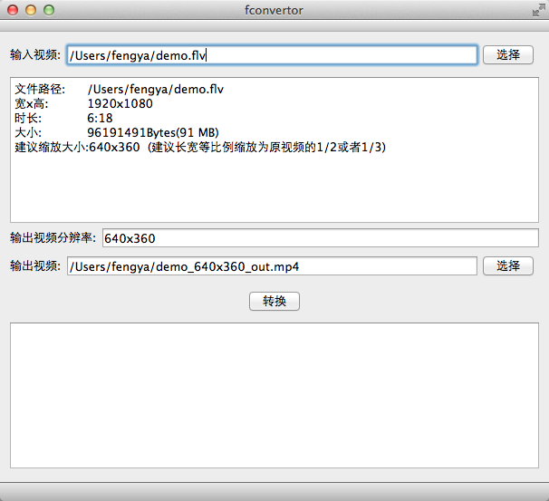
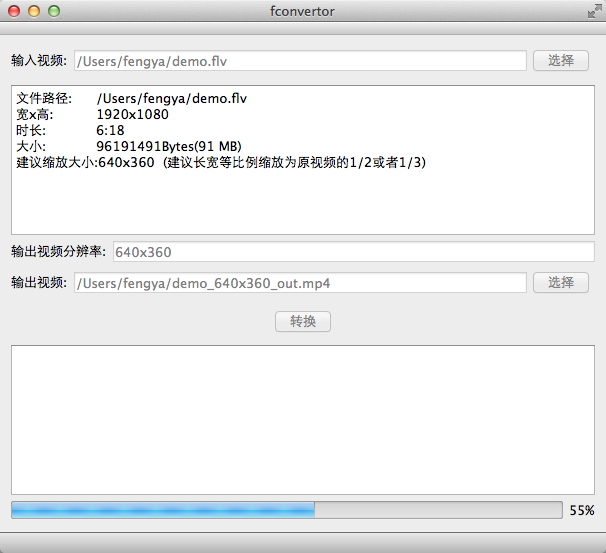
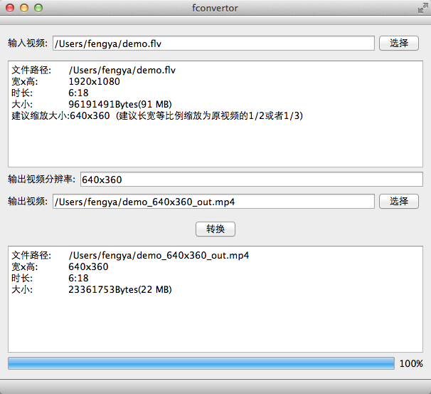

# fconvertor

## 作者

fengya90@gmail.com

## 这是什么

一个ffmpeg的GUI，目前的主要作用就是压缩视频和格式转换，主要是缩减视频长和宽。

## 下载

程序中已经包含了ffmpeg，来自 ffmpeg-79303-g0ffa9e6.7z。

[mac os x dmg](http://pan.baidu.com/s/1miMpl1m)

## 使用

